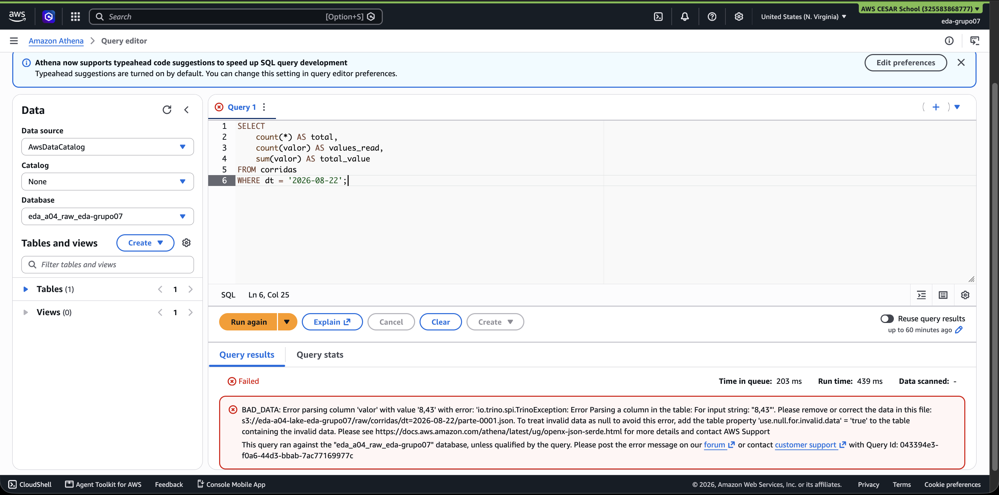
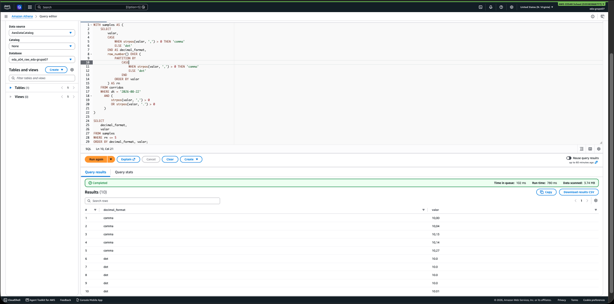
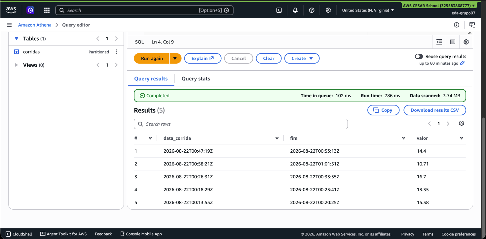
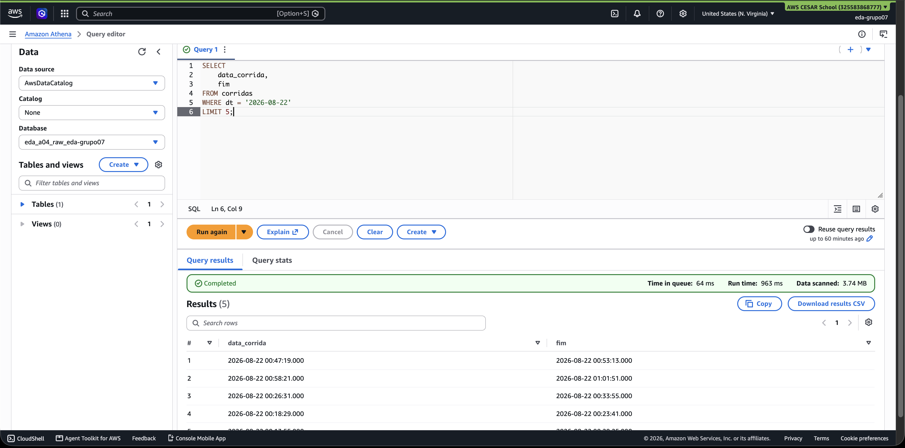
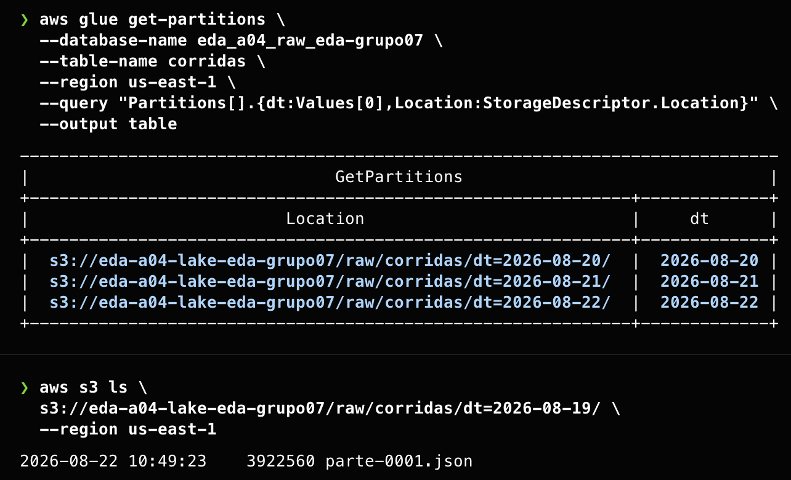
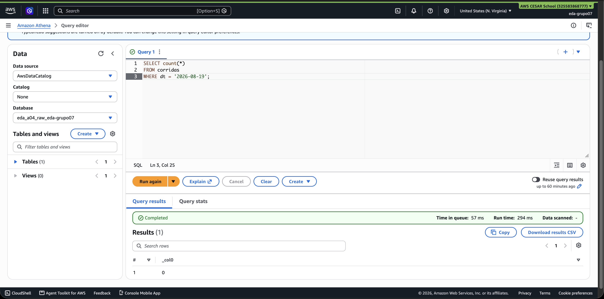
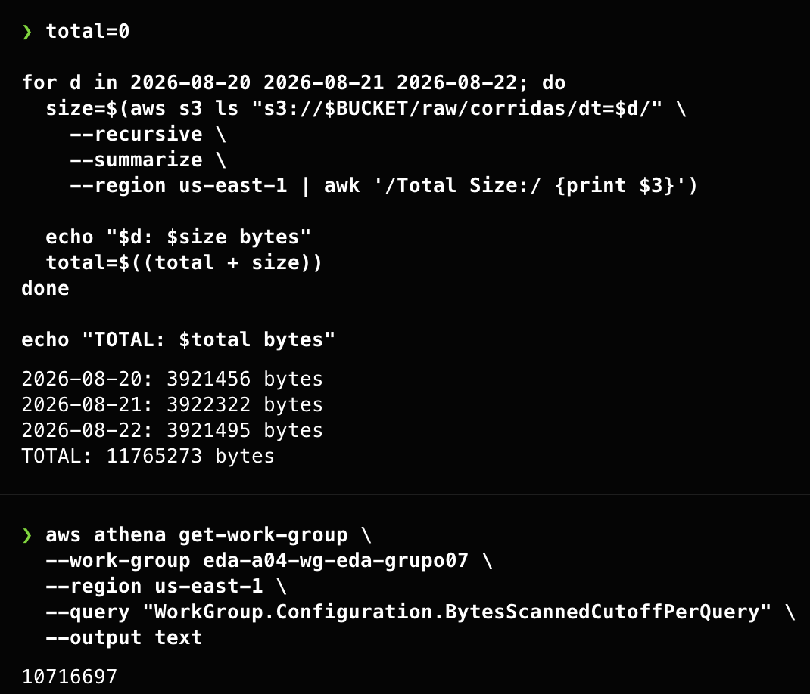
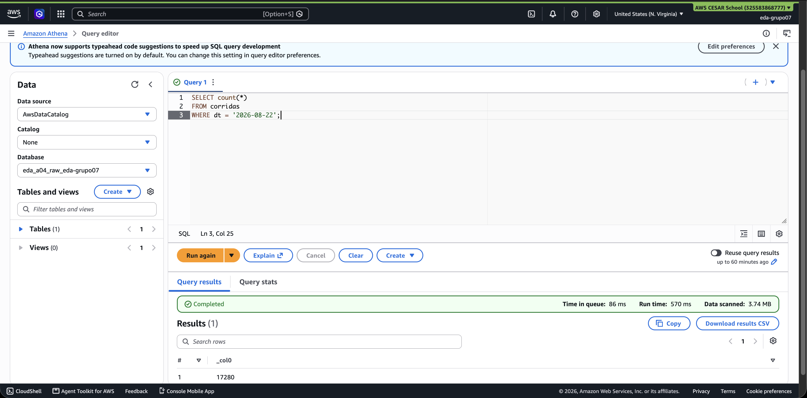
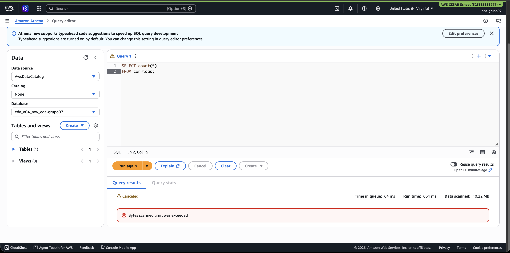

# DECISÕES

## DECISAO 01 - Tipo da coluna `valor`

Foram testados os tipos `double` e `string` para a coluna `valor`.

Durante o teste com `double`, o Athena retornou `BAD_DATA` ao encontrar valores como `"8,43"`. Isso acontece porque cerca de 1,5% dos registros utilizam vírgula como separador decimal, enquanto os demais utilizam ponto.

Optamos por manter `valor` como `string` porque a tabela representa a camada raw e, nessa etapa, a prioridade é preservar os dados da forma como foram recebidos. Dessa forma, tanto valores como `"10.2"` quanto `"8,43"` continuam disponíveis, sem perda de informação.

O trade-off é que operações numéricas, como `SUM`, `AVG` e comparações de valores, exigem uma normalização antes da análise. Em uma etapa posterior de tratamento, esses valores podem ser padronizados e convertidos para um tipo numérico adequado, como `decimal(10,2)`.

### Evidências

O teste com `double` resultou em `BAD_DATA` ao encontrar um valor com vírgula decimal:

Com `string`, os diferentes formatos recebidos na origem são preservados:

## DECISAO 02 - Tipo das colunas temporais

Foram testados os tipos `string` e `timestamp` para as colunas `data_corrida` e `fim`.

Nos dois casos o Athena retornou os dados, porém, com `timestamp`, os valores foram interpretados corretamente como data e hora, retornando resultados como `2026-08-22 00:47:19.000`, sem erros ou valores nulos.

Optamos por `timestamp` porque esse tipo representa melhor a natureza das colunas e facilita operações futuras envolvendo datas, como filtros por período, comparação entre horários e cálculo de intervalos, sem a necessidade de conversões adicionais.

O trade-off é assumir que os valores recebidos continuarão seguindo um formato compatível com `timestamp`.

### Evidências

Resultado com as colunas declaradas como `string`:

Resultado com as colunas declaradas como `timestamp`:

## DECISAO 03 - Tratamento de JSON malformado

Foi definido `true` para `ignore.malformed.json`.

A escolha foi feita para evitar que um único registro JSON malformado interrompa uma consulta inteira. Dessa forma, prioriza-se a disponibilidade da consulta mesmo quando existe algum dado problemático na origem.

O trade-off é que um problema de qualidade pode passar de forma menos evidente, aparecendo como valor nulo em vez de provocar uma falha imediata. Por isso, essa escolha exige que a qualidade dos dados seja acompanhada e tratada separadamente.

Em resumo, optou-se por manter a consulta disponível e tratar problemas de qualidade posteriormente, em vez de permitir que uma única linha inválida derrube toda a consulta.

## DECISAO 04 - Partições registradas

Foram registradas três das trinta partições disponíveis: `2026-08-20`, `2026-08-21` e `2026-08-22`, incluindo a partição correspondente ao dia atual.

A escolha por três partições permite demonstrar explicitamente a diferença entre um dado existir fisicamente no S3 e estar disponível para consulta por meio do Glue Data Catalog.

As demais partições continuam armazenadas no S3, porém não são visíveis pela tabela no Athena porque não foram registradas no catálogo e a projeção de partições está desabilitada.

Esse comportamento foi validado com a partição `2026-08-19`. O arquivo correspondente existe fisicamente no S3, mas uma consulta no Athena filtrando por essa data retorna zero linhas, pois a partição não está registrada no Glue.

O trade-off dessa escolha é operacional: sempre que uma nova partição for criada no S3, ela também precisará ser registrada no catálogo. Portanto, no dia 31, uma nova partição não ficará automaticamente disponível para consulta até que esse registro seja realizado.

### Evidências

O Glue Data Catalog possui somente as três partições registradas, enquanto a partição `2026-08-19` existe fisicamente no S3:

A consulta no Athena para `2026-08-19` retorna zero linhas porque a partição não está registrada no catálogo:

## DECISAO 05 - Limite de bytes por consulta

O limite de bytes por consulta foi definido a partir de uma medição real das três partições registradas no S3:

- `2026-08-20`: 3.921.456 bytes
- `2026-08-21`: 3.922.322 bytes
- `2026-08-22`: 3.921.495 bytes

O tamanho total medido foi de 11.765.273 bytes.

A partir dessa medição, o parâmetro `TetoBytesPorConsulta` foi definido como `10.716.697` bytes. Esse valor corresponde ao total das três partições menos 1 MiB (`1.048.576` bytes).

A intenção foi posicionar o limite entre o tamanho de uma consulta restrita a uma partição e o tamanho necessário para consultar as três partições registradas. Dessa forma, consultas específicas continuam funcionando, enquanto consultas amplas que varrem uma quantidade maior de dados são interrompidas.

O piso permitido pela AWS não foi utilizado diretamente porque o objetivo foi definir o teto com base no volume real dos dados, e não simplesmente utilizar o menor valor permitido.

Na validação, a consulta filtrada por `dt = '2026-08-22'` foi concluída com sucesso e leu aproximadamente 3,74 MB. Já a consulta sem filtro de partição foi interrompida pelo Athena com a mensagem `Bytes scanned limit was exceeded`.

O trade-off é limitar consultas que precisem analisar grandes volumes de dados de uma só vez em troca de maior controle sobre o volume escaneado e, consequentemente, sobre o custo das consultas.

### Evidências

A medição das três partições resultou em 11.765.273 bytes, enquanto o limite configurado no Athena foi de 10.716.697 bytes:

A consulta restrita à partição `2026-08-22` foi concluída com sucesso:

A consulta sem filtro de partição foi interrompida ao atingir o limite configurado:

